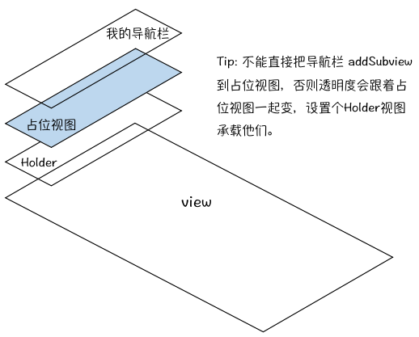

# Switf4 最新 沉浸式体验 导航栏下滑修改透明

## 效果

<p>
    

    
</p>

以前的沉浸式做法有很多，比如拿到 `navigationBar` 的 `backgroundImage` 修改透明度，或者往 `navigationBar` 的`view`层加一个占位的视图，修改这个占位视图的透明度在视觉上形成直接修改`navigationBar` 的效果。

上面的做法我都试过，也许是版本过时了。第一种 `navigationBar.subviews.first`已经不是`backgroundImage` （似乎IOS11之后已经被修改了）；第二种方法，占位视图通过`insertSubview`加入后，会阻挡`navigationItem`上的标题和图标。

我在第二种方法的基础上做了修改，既然直接在 `navigationBar`添加占位视图会阻挡标题，那就直接内容视图里添加，反正导航栏已经设置成透明的，只要这个占位视图在放在导航栏正下方，视觉上其实是一样的。


但做下去发现，每次退出页面都要恢复导航栏的样式，毕竟导航栏是多个页面共用（除非你每一个页面前都新建一个`Navigation Controller`，那就当我没说～），可是恢复透明度、背景图片巴拉巴拉的又是一堆代码，而且还有视觉上的巨大不协调性，如果每次退出都要重设一大堆东西，那也太不灵活了。我相信90%的程序员都会被这个恢复搞到头昏脑胀（包括我）。

于是想到，既然背景的透明渐变效果我都能用占位视图模拟，那干脆隐藏系统的导航栏，用新的`NavigationBar`，这样就不需要考虑恢复透明度、重设背景图片、shadow图片巴拉巴拉的问题，而只是隐藏和不隐藏的操作，一行代码的事。嗯，真香。



## 使用
透明度根据滑动的距离实时计算，注释比代码还多，看不懂就真该打了，哈哈～
```
class SecondViewController: UIViewController, UITableViewDelegate, UITableViewDataSource {
    
    @IBOutlet weak var tableView: UITableView!

    override func viewDidLoad() {
        super.viewDidLoad()
        
        // 设置导航栏颜色为白色
        setCustomNavigationBar(.white)
        
        // 导航栏的一些图标
        let mNavigationItem = UINavigationItem()
        let lbtn = UIBarButtonItem(title: "返回", style: .plain, target: self, action: #selector(back))
        mNavigationItem.setLeftBarButton(lbtn, animated: true)
        
        customNavigationBar?.items = [mNavigationItem]

        ... // 省略非关键代码
    }

    ... // 省略非关键代码

    // MARK: 重写该方法，以便根据滑动距离确认透明度的取值。能下拉的空间肯定有 Scroll View，比如 Table View
    func scrollViewDidScroll(_ scrollView: UIScrollView) {
        if(navigationController == nil) {
            return
        }
        
        // 状态栏高度
        let statusBarHeight = UIApplication.shared.statusBarFrame.height
        
        // 最大偏移量: scrollView向下滑动该距离 后 导航栏全不透明
        let maxAlphaOffset = CGFloat(200)
        // 最小偏移量: scrollView向下滑动该距离 前 导航栏全透明
        let minAlphaOffset = CGFloat(0)
        
        // 已滑动距离: 加上状态栏的高度是因为scrollView一开始
        // 已经默认向上滑动了这段距离，可以自己打印看看偏移量
        let offset = scrollView.contentOffset.y + statusBarHeight
        
        // 按比例计算alpha，且取值必须在 [0,1]
        let a = max(min((offset - minAlphaOffset) / (maxAlphaOffset - minAlphaOffset), 1), 0)
        
        // 根据计算得到的alpha修改导航栏透明度
        setCustomNavigationBarColor(alpha: a)
        // 导航栏字体或者图标的颜色也可以跟着修改
        customNavigationBar!.tintColor = UIColor(red: 1 - a, green: 1 - a, blue: 1 - a, alpha: 1)
    }
    
    override func viewWillDisappear(_ animated: Bool) {
        super.viewWillDisappear(animated)
        // 离开当前页面需要恢复导航栏样式，不影响其他页面
        restoreNavigationBar()
    }
}
```
## 注意
暂时还不支持 `UITableViewController`，虽然 `UITableViewController ` 继承了 `UIViewController`，但是你会发现，如果你调用`setCustomNavigationBar`，导航栏被直接添加到了`Scroll View` 上，也就是说导航栏会跟着页面滑动。

如果你已经写好了`UITableViewController`，其实很简单，把`Table View`嵌入到一个`UIViewController`上。千万别说只会用`UITableViewController`，不知道怎么取出里面的`Table View`，那你就真的还要修炼修炼了。

如果觉得对你有帮助请留下你的Star。有问题也请及时和我沟通，欢迎指正。

第一张动图是我开源的入门项目，无须后台，即下即用，供大家学习、作业使用，哈哈

地址：[一个在线购书App](https://github.com/XuJiaLe1997/BookShopIOS)

###### Copyright © 2020 许家乐

